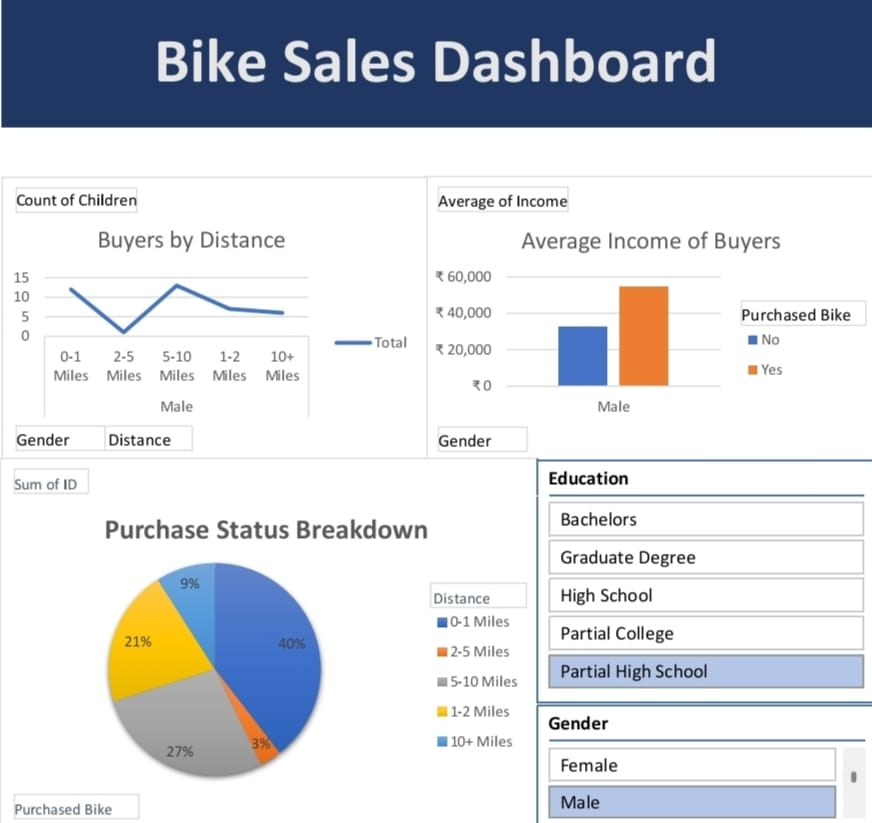

BikeSalesDashboard.xlsx

🚴 Bike Sales Excel Dashboard

📌 Project Overview

This Excel dashboard visualizes bike sales data to analyze customer preferences and business performance.

🎯 Objective

To help business users quickly identify sales trends by region, customer type, gender, and age group.

🛠 Tools Used

Microsoft Excel

Pivot Tables

Slicers

Charts

Data Cleaning techniques

📊 Insights Gained

Here are your points in bullet form:

* Adult customers make the highest purchases
* The West region shows better performance than others
* Male customers have slightly more bike purchases
* Income level influences purchase decisions

📁 Files Included

BikeSalesDashboard.xlsx — Final dashboard
### Dashboard Preview

